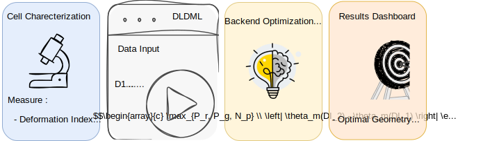

# DLDML: Physics-Guided Machine Learning for DLD Device Optimization

DLDML is a physics-guided machine learning framework for inverse design of Deterministic Lateral Displacement (DLD) microfluidic devices. This tool transforms measured cellular deformability into fabrication-ready device specifications through XGBoost surrogate modeling and Bayesian optimization, enabling rapid DLD device design in under 60 seconds.

By integrating high-fidelity lattice-Boltzmann simulations with gradient-boosted machine learning, DLDML achieves sub-degree predictive accuracy and systematically maps cellular mechanical properties to optimal array geometry. The framework quantifies parameter interactions through Type II ANOVA and provides tolerance-aware inverse design that identifies robust operational regimes for manufacturing variability.



## Key Features

- **Inverse Design**: Transforms measured deformation index (DI) into optimal DLD geometry (Pr, Pg, α)
- **High-Fidelity Surrogates**: XGBoost model with R² = 0.9999, MSE = 2×10⁻⁴
- **Rapid Optimization**: Sub-60 second optimization using Optuna TPE sampler
- **Physical Constraints**: Enforces Pg > Pr + 0.5 μm safety margin
- **Statistical Validation**: Type II ANOVA with interaction analysis (p < 10⁻³⁰)
- **Web Deployment**: Accessible FastAPI + Streamlit interface

## Quick Start

### Prerequisites

- Python 3.10+
- Virtual environment (recommended)

### Installation

```bash
# Clone the repository
git clone https://github.com/Khayrulbuet13/dldml.git
cd dldml

# Create and activate virtual environment
python -m venv dld_env
source dld_env/bin/activate  # On Linux/Mac
# or: dld_env\Scripts\activate  # On Windows

# Install dependencies
pip install -r requirements.txt
```

### Running the Application

**Option 1: Local Development**

```bash
# Start backend (Terminal 1)
python -m uvicorn backend.api.app:app --host 0.0.0.0 --port 8000 --reload

# Start frontend (Terminal 2)
streamlit run app/main.py --server.port 8501
```

**Option 2: Docker Deployment**

```bash
docker-compose up -d
```

**Access the Application:**
- Frontend UI: http://localhost:8501
- Backend API: http://localhost:8000
- API Documentation: http://localhost:8000/docs

## Usage

### Input Parameters

Configure in the web interface:
- **Cell Parameters**: DI₁, DI₂ (deformation indices [0-1]), R₁, R₂ (cell radii)
- **Geometry Ranges**: Pr (pillar radius), Pg (pillar gap), α (row shift angle)
- **Optimization**: Number of trials, startup trials

### Optimization Process

1. Input measured deformation indices for two cell types
2. Set geometric parameter ranges and constraints
3. Run Bayesian optimization (TPE sampler)
4. Obtain optimal device geometry with parameter importance analysis

### API Example

```bash
curl -X POST http://localhost:8000/api/v1/optimize \
  -H "Content-Type: application/json" \
  -d '{
    "DI1": 0.5, "DI2": 0.8,
    "R1": 7.5, "R2": 7.5,
    "Pr_min": 4.0, "Pr_max": 10.0,
    "Pg_min": 12.0, "Pg_max": 22.0,
    "alpha_min": 1.0, "alpha_max": 5.0,
    "n_trials": 100
  }'
```

## Project Structure

```
dldml/
├── app/
│   └── main.py                   # Streamlit frontend
├── backend/
│   ├── api/
│   │   ├── app.py               # FastAPI application
│   │   ├── models.py            # Pydantic models
│   │   └── routes.py            # API endpoints
│   └── optimizers/
│       ├── dld_optimizer.py     # Optimization engine
│       └── optimization_model.py # ML model interface
├── config/                       # Configuration files
├── models/
│   └── trained_model.joblib     # XGBoost surrogate model
├── tests/
│   └── test_optimizer.py        # Test suite
├── docker-compose.yml            # Docker orchestration
├── requirements.txt              # Python dependencies
└── README.md
```

## Parameter Notation

| Paper | Code | Description | Type |
|-------|------|-------------|------|
| P_r | Pr | Pillar radius | Continuous (μm) |
| P_g | Pg | Pillar gap | Continuous (μm) |
| N_p | α (alpha) | Row shift angle | Continuous (degrees) |
| DI | DI | Deformation index | [0-1] |

**Note:** The paper uses integer periodicity N_p while the code uses continuous angle α (degrees). Both represent row shift in the DLD array; the continuous representation enables finer optimization granularity.

## Built With

* [![FastAPI][FastAPI-shield]][FastAPI-url]
* [![Streamlit][Streamlit-shield]][Streamlit-url]
* [![XGBoost][XGBoost-shield]][XGBoost-url]
* [![Optuna][Optuna-shield]][Optuna-url]
* [![Plotly][Plotly-shield]][Plotly-url]
* [![NumPy][NumPy-shield]][NumPy-url]

## Testing

```bash
pytest tests/ -v
```

## License

Distributed under the MIT License. See `LICENSE.txt` for details.

## Citation

This tool implements the optimization framework from:

**Physics-Guided Surrogate Modeling for Machine Learning–Driven DLD Design Optimization**  
Khayrul Islam, Mehedi Hasan, Yaling Liu  
*Submitted to Journal of the American Chemical Society*, 2025

If you use this tool in your research, please cite:

```bibtex
@article{islam2025dld,
  title={Physics-Guided Surrogate Modeling for Machine Learning–Driven DLD Design Optimization},
  author={Islam, Khayrul and Hasan, Mehedi and Liu, Yaling},
  journal={Journal of the American Chemical Society},
  year={2025},
  note={Submitted}
}
```

## Contact

Khayrul Islam - [@LinkedIn](https://linkedin.com/in/khayrulbuet13) - khayrulbuet13@alum.lehigh.edu

Project Link: [https://github.com/Khayrulbuet13/dldml](https://github.com/Khayrulbuet13/dldml)

## Acknowledgments

This research was conducted at:
- Department of Mechanical Engineering, Lehigh University
- Computational Engineering Department, Lawrence Livermore National Laboratory
- Precision Medicine Translational Research Center, West China Hospital, Sichuan University

---

**Happy Optimizing! 🚀**

<!-- MARKDOWN LINKS & IMAGES -->
[FastAPI-shield]: https://img.shields.io/badge/FastAPI-009688?style=for-the-badge&logo=FastAPI&logoColor=white
[FastAPI-url]: https://fastapi.tiangolo.com

[Streamlit-shield]: https://img.shields.io/badge/Streamlit-FF4B4B?style=for-the-badge&logo=Streamlit&logoColor=white
[Streamlit-url]: https://streamlit.io

[XGBoost-shield]: https://img.shields.io/badge/XGBoost-337ab7?style=for-the-badge&logo=xgboost&logoColor=white
[XGBoost-url]: https://xgboost.readthedocs.io

[Optuna-shield]: https://img.shields.io/badge/Optuna-3776AB?style=for-the-badge&logo=optuna&logoColor=white
[Optuna-url]: https://optuna.org

[Plotly-shield]: https://img.shields.io/badge/Plotly-3F4F75?style=for-the-badge&logo=plotly&logoColor=white
[Plotly-url]: https://plotly.com

[NumPy-shield]: https://img.shields.io/badge/NumPy-013243?style=for-the-badge&logo=NumPy&logoColor=white
[NumPy-url]: https://numpy.org
